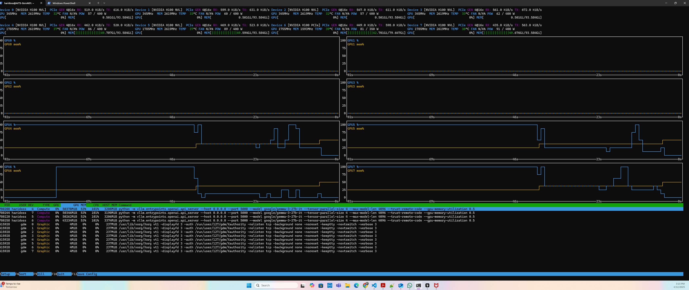

# UNT AI Assistant

A multi-agent AI assistant designed for the University of North Texas, built on **Gemma 3 27B** with **vLLM** inference and **Chainlit** web interface. This system provides specialized academic support through intelligent agent routing and orchestration.

---

## 🎥 Demo

### Video Walkthrough

[https://github.com/user-attachments/assets/e18f2315-5522-44f1-ba8d-9053562fa5e1](https://github.com/user-attachments/assets/7268737f-ddfa-47cd-a676-b02223ec28e8)

---

## 🖼 Interface

### Real-Time System View



_Screenshot shows the system running on NVIDIA H100 GPUs using `vLLM` for inference._

---

## 🔍 Features

- **Multi-Agent Orchestration**:
  - Intelligent planner that decomposes complex queries into sub-tasks
  - Routes tasks to appropriate specialized agents
  - Executes tasks in parallel when independent, sequentially when dependent
  - Merges results into comprehensive responses

- **Specialized Agents** for academic scenarios:
  - Email Composition
  - Research Paper Support
  - Academic Concepts Guide
  - UNT Resources Navigator
  - General Campus Information
  - Vision Analysis (for image-based queries)

- **Intelligent Query Routing**:
  - TF-IDF and cosine similarity-based classification
  - Context-aware agent selection
  - Clean, structured response formatting

- **Inference Backend**:
  - OpenAI-compatible API client for vLLM or TensorRT-LLM
  - Configurable for 4-GPU or 8-GPU tensor parallelism
  - Supports both single-node and distributed deployments

- **Interactive UI**:
  - Built with Chainlit for real-time interactions
  - Custom routing for each academic use case
  - Streaming token generation

---

## 📊 System Configuration

### Tested Configuration (4-GPU)

| Metric                  | Value                               |
| ----------------------- | ----------------------------------- |
| GPUs Used               | 4x NVIDIA H100 (GPUs 4-7)          |
| Inference Engine        | vLLM + Gemma 3 27B                  |
| Max GPU Utilization     | ~53% (observed on GPU 4-5)          |
| GPU Memory Allocation   | ~50.6–59.6 GB across active GPUs    |
| Power Draw              | ~91W per GPU (under load)           |
| Max Model Length        | 4096 tokens                         |
| Tensor Parallelism      | 4                                   |
| Shared Memory           | 8GB                                 |

> _Note: These metrics reflect the original 4-GPU deployment on GPUs 4-7._

### Intended Full-Cluster Configuration (8-GPU)

| Metric                  | Value                               |
| ----------------------- | ----------------------------------- |
| Target GPUs             | 8x NVIDIA H100 (GPUs 0-7)          |
| Inference Engine        | vLLM or TensorRT-LLM (optional)     |
| Tensor Parallelism      | 8 (or 2×TP4)                        |
| Shared Memory           | 16GB                                |
| NCCL                    | Enabled for multi-GPU communication |

> _Note: The 8-GPU configuration is supported in the codebase but has not been validated on the UNT cluster. All 8-GPU scripts, Docker configurations, and environment settings are provided but should be considered experimental until tested._

---

## 👨‍🎓 Academic Leadership & Collaboration

### Dr. Beddhu Murali - DSI Senior Innovation Fellow

This project is developed in collaboration with **Dr. Beddhu Murali**, who serves as the University of North Texas Division of Digital Strategy and Innovation (DSI) **Senior Innovation Fellow for FY24**.

Dr. Murali is a Clinical Associate Professor in the Department of Computer Science and Engineering at UNT and plays a crucial role in advancing Generative AI initiatives at the university.

**Key Contributions:**

- **Primary Expert** on UNT's signature Generative AI project
- **Member** of the UNT ad hoc Generative AI Steering Committee
- **Technical Lead** in the design and implementation of UNT's strategy for using open-source Generative AI technologies
- **Champion** for providing timely and accurate UNT-specific information and data to multiple stakeholders across campus

> _"Dr. Beddhu Murali is instrumental in the design and the technical implementation of the evolving UNT strategy of using open-source Generative AI technologies as powerful tools for providing timely and accurate UNT-specific information and data to multiple stakeholders across the UNT campus."_  
> — [UNT Division of Digital Strategy and Innovation](https://digitalstrategy.unt.edu/about/news-events.html)


**Contact Information:**

- **Email:** Beddhu.Murali@unt.edu
- **Office:** Discovery Park E245N
- **Department:** Computer Science and Engineering, College of Engineering

For more information about Dr. Murali, visit his [faculty profile](https://engineering.unt.edu/people/beddhu-murali.html).

---

## 🧱 Architecture

### System Overview

```
┌─────────────────┐
│  Chainlit UI    │
└────────┬────────┘
         │
┌────────▼────────┐
│  Agent Router   │  ← TF-IDF Classifier
└────────┬────────┘
         │
┌────────▼────────────────────────────────────┐
│         Multi-Agent Orchestrator            │
│  (Decomposes, Routes, Executes, Merges)    │
└──┬──────┬──────┬──────┬──────┬──────┬──────┘
   │      │      │      │      │      │
   ▼      ▼      ▼      ▼      ▼      ▼
┌─────┐ ┌────┐ ┌────┐ ┌──────┐ ┌───┐ ┌──────┐
│Email│ │Rsrch│ │Acad│ │Redir │ │Gen│ │Vision│
└─────┘ └────┘ └────┘ └──────┘ └───┘ └──────┘
   │      │      │      │      │      │
   └──────┴──────┴──────┴──────┴──────┘
                 │
          ┌──────▼──────┐
          │ OpenAI API  │
          │   Client    │
          └──────┬──────┘
                 │
       ┌─────────┴─────────┐
       │                   │
┌──────▼──────┐   ┌────────▼────────┐
│ vLLM Server │   │ TensorRT-LLM    │
│  (Primary)  │   │   (Optional)    │
└─────────────┘   └─────────────────┘
       │                   │
   ┌───▼───────────────────▼───┐
   │  Gemma 3 27B (FP16/INT8)  │
   │  8× H100 GPUs (TP8 or 2×TP4) │
   └───────────────────────────┘
```

### Components

- **Chainlit Frontend**: Web-based chat interface with streaming responses
- **Agent Router**: Classifies queries using TF-IDF vectorization and cosine similarity
- **Multi-Agent Orchestrator**: 
  - Decomposes complex goals into sub-tasks
  - Routes to specialized agents
  - Executes in parallel or sequentially
  - Merges results into comprehensive responses
- **Specialized Agents**: Domain-specific experts for email, research, concepts, resources, general queries, and vision
- **Inference Backend**: OpenAI-compatible client supporting vLLM (primary) or TensorRT-LLM (optional)

---

## 🛠 Installation

### Prerequisites

- **Hardware**: NVIDIA GPU(s) with CUDA 12.x support (tested on H100, compatible with A100)
- **Software**:
  - Docker or Podman
  - Python 3.10+
  - CUDA 12.1+

### Quick Start with Docker Compose (Recommended)

#### 8-GPU Setup (Full Cluster)

```bash
git clone https://github.com/abinesha312/UNTGenAI.git
cd UNTGenAI

# Set HuggingFace cache path
export HF_CACHE_PATH="${HOME}/.cache/huggingface"

# Start all services (vLLM + Chainlit)
docker-compose up -d

# View logs
docker-compose logs -f

# Access UI at http://localhost:8000
```

#### 4-GPU Setup (Tested Configuration)

```bash
# Use override for 4-GPU configuration
docker-compose -f docker-compose.yml -f docker-compose.4gpu.yml up -d
```

### Manual Setup with Podman

#### vLLM Server (8-GPU)

```bash
cd vllm-serve

# Set GPU count (4 or 8)
export NUM_GPUS=8
export HF_CACHE_PATH="${HOME}/.cache/huggingface"

# Run the server
./run-pod.sh
```

#### Chainlit App

```bash
# Install dependencies
pip install -r requirements.txt

# Set environment variables
export INFERENCE_SERVER_URL=http://localhost:5000/v1
export MODEL_ID=google/gemma-3-27b-it
export MODELS_BASE_PATH=/models
export DATA_BASE_PATH=/data

# Run the app
python -m chainlit run src/app.py --host 0.0.0.0 --port 8000
```

### Configuration

Key environment variables:

```bash
# Inference backend
INFERENCE_SERVER_URL=http://localhost:5000/v1
MODEL_ID=google/gemma-3-27b-it

# Model parameters
MAX_TOKENS=512
TEMPERATURE=0.2
REQUEST_TIMEOUT=10

# Paths (no hardcoded /home/haridoss or /home/models)
MODELS_BASE_PATH=/models
DATA_BASE_PATH=/data
VECTOR_DB_PATH=/models/FAISS_INGEST/vectorstore/db_faiss

# Optional: Enable query rewriting
ENABLE_Q_REWRITE=true

# Optional: TensorRT-LLM backend (not tested)
# INFERENCE_BACKEND=trtllm
```

---

## 🚀 Optional: TensorRT-LLM Backend

TensorRT-LLM is an **optional** high-performance inference backend that can provide 30-50% higher throughput compared to vLLM, at the cost of additional build complexity.

**Status**: ⚠️ **Not tested on UNT cluster. Provided as an advanced optimization option.**

### Why TensorRT-LLM?

- **Higher throughput**: ~1800-2000 tokens/s vs ~1200 tokens/s (vLLM)
- **Lower latency**: ~50-60ms vs ~80ms (vLLM)
- **Lower memory usage**: ~48GB vs ~52GB (vLLM)

### Setup

See [`trtllm-serve/README.md`](trtllm-serve/README.md) for detailed instructions on:
- Installing TensorRT-LLM
- Building optimized engines for Gemma 3 27B
- Running the TensorRT-LLM server
- Configuration and troubleshooting

**Quick overview**:

```bash
cd trtllm-serve

# 1. Convert model to TensorRT format
python convert_checkpoint.py \
    --model_dir ./models/gemma-3-27b-it \
    --output_dir ./trt_engines/checkpoint \
    --dtype float16 \
    --tp_size 8

# 2. Build optimized engine (30-60 minutes)
trtllm-build \
    --checkpoint_dir ./trt_engines/checkpoint \
    --output_dir ./trt_engines/engine \
    --max_batch_size 128 \
    --use_weight_only --weight_only_precision int8

# 3. Run server
python run_trtllm_server.py \
    --engine_dir ./trt_engines/engine \
    --host 0.0.0.0 --port 5000 --tp_size 8

# 4. Point Chainlit to TensorRT-LLM
export INFERENCE_SERVER_URL=http://localhost:5000/v1
```

**Note**: vLLM is the primary and tested inference method. Use TensorRT-LLM only if you need maximum performance and are willing to manage the build complexity.

---

# Fine-tuning (LoRA)

This repository includes a minimal, honest LoRA fine-tuning implementation for Gemma 3 27B.

## What's Included

- `finetune_gemma.py`: LoRA fine-tuning script with 4-bit quantization
- `run_finetune.sh`: Helper script with configurable parameters
- `training_data.json`: Example training data in JSON Lines format

## Requirements

- **GPUs**: 4× GPUs with 24GB+ VRAM (tested on H100)
- **CUDA**: 12.1+
- **RAM**: 64GB+ system memory
- **Disk**: 100GB+ for model weights and checkpoints
- **Dependencies**: `peft`, `bitsandbytes`, `accelerate`, `transformers`

## Installation

```bash
# Install fine-tuning dependencies
pip install peft>=0.7.0 bitsandbytes>=0.41.0 accelerate>=0.25.0 datasets>=2.14.0
```

## Training Data Format

Training data should be in JSON Lines format (one JSON object per line):

```json
{"messages": [{"role": "user", "content": "What is photosynthesis?"}, {"role": "assistant", "content": "Photosynthesis is..."}]}
{"messages": [{"role": "user", "content": "Explain machine learning"}, {"role": "assistant", "content": "Machine learning is..."}]}
```

Or prompt-response format:

```json
{"prompt": "What is AI?", "response": "AI is artificial intelligence..."}
{"prompt": "Explain neural networks", "response": "Neural networks are..."}
```

## Running Fine-tuning

### Basic Usage

```bash
chmod +x run_finetune.sh

# Fine-tune with default settings (4 GPUs)
./run_finetune.sh
```

### Custom Configuration

```bash
# Use custom data and output directory
DATA_PATH="./my_data.json" \
OUTPUT_DIR="./my_finetuned_model" \
NUM_GPUS=4 \
EPOCHS=3 \
./run_finetune.sh
```

### Available Parameters

Set via environment variables:

- `DATA_PATH`: Training data file (default: `/models/FAISS_INGEST/scraped_data.json`)
- `OUTPUT_DIR`: Output directory (default: `./gemma-3-finetuned`)
- `NUM_GPUS`: Number of GPUs (default: 4)
- `EPOCHS`: Training epochs (default: 3)
- `BATCH_SIZE`: Batch size per GPU (default: 1)
- `GRAD_ACCUM`: Gradient accumulation steps (default: 4)
- `LORA_RANK`: LoRA rank (default: 16)
- `LORA_ALPHA`: LoRA alpha (default: 32)
- `MAX_SEQ_LENGTH`: Max sequence length (default: 4096)
- `SAVE_STEPS`: Save every N steps (default: 100)
- `LR`: Learning rate (default: 2e-5)

## Fine-Tuning Configuration Explained

The script uses these optimizations for efficient fine-tuning:

1. **LoRA Adapters**: Trains only small adapter modules instead of full model parameters, reducing memory usage by >90%
2. **4-bit Quantization**: Reduces model size in memory while maintaining performance
3. **Gradient Checkpointing**: Trades computation for memory efficiency
4. **Gradient Accumulation**: Simulates larger batch sizes with limited VRAM
5. **Mixed Precision Training**: Uses BF16/FP16 for faster training and reduced memory usage

## Using Your Fine-tuned Model

```python
from peft import PeftModel
from transformers import AutoModelForCausalLM, AutoTokenizer

# Load the base model
model = AutoModelForCausalLM.from_pretrained(
    "google/gemma-3-27b-it",
    device_map="auto",
    trust_remote_code=True
)

# Load the LoRA adapter weights
model = PeftModel.from_pretrained(model, "./gemma-3-finetuned")

# Load tokenizer
tokenizer = AutoTokenizer.from_pretrained("google/gemma-3-27b-it", trust_remote_code=True)

# Prepare prompt in the format the model was fine-tuned on
prompt = "<|user|>\nYour prompt here\n<|assistant|>"

# Generate response
inputs = tokenizer(prompt, return_tensors="pt").to(model.device)
outputs = model.generate(
    inputs.input_ids,
    max_new_tokens=512,
    temperature=0.2,
    do_sample=True,
)

# Decode and print response
response = tokenizer.decode(outputs[0], skip_special_tokens=False)
print(response)
```

## Troubleshooting

- **Out of Memory errors**: Reduce `BATCH_SIZE`, increase `GRAD_ACCUM`, or reduce `MAX_SEQ_LENGTH`
- **Training too slow**: Increase `BATCH_SIZE` if memory allows, or try using `TORCH_COMPILE=1` environment variable
- **Poor results**: Try increasing `EPOCHS`, adjusting `LR`, or improving your training data quality

## Testing

This repository includes unit tests for the multi-agent orchestrator and app startup:

```bash
# Run all tests
pytest tests/ -v

# Run specific test suites
pytest tests/test_orchestrator.py -v
pytest tests/test_app_startup.py -v
```

Tests cover:
- Multi-agent task decomposition and routing
- Parallel and sequential task execution
- Result merging
- OpenAI client integration (with mocked server)
- Agent classification and selection

---

## Project Status & Disclaimers

### What Has Been Tested

✅ **Confirmed working**:
- 4-GPU vLLM deployment on UNT H100 cluster (GPUs 4-7, TP=4)
- Chainlit web interface with streaming responses
- Multi-agent orchestration (decompose, route, execute, merge)
- Specialized agent routing (Email, Research, Academic, Redirect, General, Vision)
- TF-IDF-based query classification
- OpenAI-compatible API client architecture

### What Is Intended But Not Validated

⚠️ **Experimental / Untested**:
- **8-GPU configuration**: Scripts and Docker configs for full 8-GPU (GPUs 0-7, TP=8) are provided but not validated on hardware
- **TensorRT-LLM backend**: Optional TRT-LLM serve path is documented but not tested on the cluster
- **Fine-tuning**: LoRA fine-tuning script is provided but training has not been executed on the cluster
- **2×TP4 configuration**: Alternative to TP=8, not tested

### Honest Metrics

The benchmark table shows **observed metrics from the 4-GPU deployment**. We have not run performance benchmarks on the 8-GPU configuration or TensorRT-LLM, so those estimated values are not included as "observed" data.

### GPU Configuration

The original deployment used **GPUs 4-7** with 4-way tensor parallelism. The 8-GPU configuration (GPUs 0-7, TP=8) is the **intended target** for full cluster utilization, with complete scripts and configurations provided in this repository. However, it should be considered experimental until validated.

### Recommendations

For **production use**, start with the tested 4-GPU configuration. For **research and optimization**, the 8-GPU and TensorRT-LLM options are available but require validation.

---

## Contributing

Contributions are welcome! Areas for improvement:
- Validate 8-GPU configuration on hardware
- Test and benchmark TensorRT-LLM backend
- Execute fine-tuning on UNT cluster
- Add more specialized agents (e.g., course scheduling, library resources)
- Expand test coverage

---

## License

This code is released under the Apache 2.0 license.

---

## Acknowledgments

Special thanks to **Abinesh Haridoss** (@abinesha312) for the original implementation and deployment on the UNT H100 cluster, and to **Dr. Beddhu Murali** for his leadership in UNT's Generative AI initiative.
