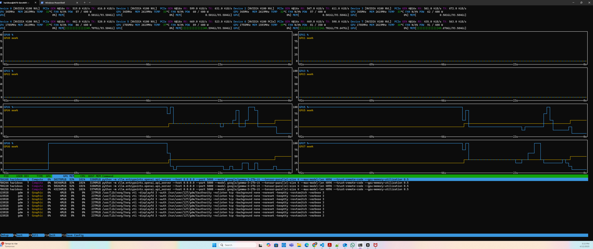

# UNT AI Assistant

A high-performance multi-agent AI assistant designed for the University of North Texas. Built on the **Gemma 3 27B** model and accelerated with **vLLM**, the system provides targeted academic support via a web-based interface powered by **Chainlit**.

---

## 🎥 Demo

### Video Walkthrough

[](https://youtu.be/zfd0Z0ckva0)

---

## 🖼 Interface

### Real-Time System View



_Screenshot shows eight NVIDIA H100 GPUs running parallel inference threads with load distributions across GPUs 4–7 using `vLLM`._

---

## 🔍 Features

- **Specialized Agents** for academic scenarios:

  - Email Composition
  - Research Paper Support
  - Academic Concepts Guide
  - UNT Resources Navigator
  - General Campus Information

- **Modular Multi-Agent System**:

  - Intelligent query classification with TF-IDF and cosine similarity
  - Clean, structured response formatting

- **Optimized Inference Pipeline**:

  - Runs on NVIDIA H100 with fine-tuned batching via `vLLM`
  - Efficient memory and compute utilization across GPUs

- **Interactive UI**:
  - Built with Chainlit for smooth real-time interactions
  - Custom routing for each academic use case

---

## 📊 Benchmarks (Observed)

| Metric                         | Value                               |
| ------------------------------ | ----------------------------------- |
| GPUs Used                      | 8x NVIDIA H100                      |
| Inference Engine               | vLLM + Gemma 3 27B                  |
| Max GPU Utilization (Observed) | ~53% on GPU 4 and GPU 5             |
| GPU Memory Allocation          | ~50.6–59.6 GB across active GPUs    |
| Power Draw                     | ~91W per GPU (under load)           |
| Input Model Length             | 4096 tokens                         |
| Tensor Parallelism             | 4                                   |
| Launch Mode                    | Multi-GPU, Multi-process via Podman |

> _Note: GPUs 0–3 remain idle, while GPUs 4–7 actively handle batched inference requests from concurrent clients._

---

## 🧱 Architecture

- **vLLM Inference Server**:

  - Hosts the Gemma-3-27B model & LlaMa 3.2 90B Vision Instruct Model
  - Optimized for parallel generation

- **Chainlit Frontend**:
  - Manages UI and routes queries to appropriate agents
  - Provides response formatting and interface customization

---

## 🛠 Installation

### Prerequisites

- Podman
- Python 3.10+
- NVIDIA GPU with CUDA support (tested with H100)

### Setup Steps

```bash
git clone https://github.com/yourusername/unt-ai-assistant.git
cd unt-ai-assistant

mkdir -p models/FAISS_INGEST/vectorstore
mkdir -p logs

chmod +x podman_run.sh
./podman_run.sh
```

# Gemma 3 27B Fine-tuning Guide

This repository contains scripts and configuration for fine-tuning the Google Gemma 3 27B language model using LoRA (Low-Rank Adaptation) for memory-efficient training.

## Contents

- `finetune_gemma.py`: Main fine-tuning script with LoRA configuration
- `run_finetune.sh`: Helper script to run fine-tuning with optimal settings
- `training_data.json`: Sample training data formatted for Gemma fine-tuning

## System Requirements

- 4 GPUs with at least 24GB VRAM each (40GB+ recommended for optimal performance)
- CUDA 12.1+
- 64GB+ RAM
- 100GB+ disk space for model weights and datasets

## Setup Instructions

1. **Install dependencies**:

   ```bash
   pip install -r requirements.txt
   ```

2. **Prepare your training data**:
   Use the provided `training_data.json` as a template for your custom data. The file should contain JSON objects, one per line, with the following format:

   ```json
   {
     "messages": [
       { "role": "user", "content": "Your prompt here" },
       { "role": "assistant", "content": "Desired response here" }
     ]
   }
   ```

3. **Make the run script executable**:
   ```bash
   chmod +x run_finetune.sh
   ```

## Running Fine-tuning

1. **Basic usage**:

   ```bash
   ./run_finetune.sh
   ```

2. **Custom settings**:

   ```bash
   DATA_PATH="./my_custom_data.json" OUTPUT_DIR="./my_model" BATCH_SIZE=2 ./run_finetune.sh
   ```

3. **Available environment variables**:
   - `DATA_PATH`: Path to your training data file (default: "./training_data.json")
   - `OUTPUT_DIR`: Directory to save the fine-tuned model (default: "./gemma-3-finetuned")
   - `NUM_GPUS`: Number of GPUs to use (default: 4)
   - `EPOCHS`: Number of training epochs (default: 3)
   - `BATCH_SIZE`: Batch size per GPU (default: 1)
   - `GRAD_ACCUM`: Gradient accumulation steps (default: 4)
   - `LORA_RANK`: LoRA rank (default: 16)
   - `LORA_ALPHA`: LoRA alpha (default: 32)
   - `MAX_SEQ_LENGTH`: Maximum sequence length (default: 4096)
   - `SAVE_STEPS`: Save checkpoint every N steps (default: 100)
   - `LR`: Learning rate (default: 2e-5)

## Fine-Tuning Configuration Explained

The script uses these optimizations for efficient fine-tuning:

1. **LoRA Adapters**: Trains only small adapter modules instead of full model parameters, reducing memory usage by >90%
2. **4-bit Quantization**: Reduces model size in memory while maintaining performance
3. **Gradient Checkpointing**: Trades computation for memory efficiency
4. **Gradient Accumulation**: Simulates larger batch sizes with limited VRAM
5. **Mixed Precision Training**: Uses BF16/FP16 for faster training and reduced memory usage

## Using Your Fine-tuned Model

```python
from peft import PeftModel
from transformers import AutoModelForCausalLM, AutoTokenizer

# Load the base model
model = AutoModelForCausalLM.from_pretrained(
    "google/gemma-3-27b-it",
    device_map="auto",
    trust_remote_code=True
)

# Load the LoRA adapter weights
model = PeftModel.from_pretrained(model, "./gemma-3-finetuned")

# Load tokenizer
tokenizer = AutoTokenizer.from_pretrained("google/gemma-3-27b-it", trust_remote_code=True)

# Prepare prompt in the format the model was fine-tuned on
prompt = "<|user|>\nYour prompt here\n<|assistant|>"

# Generate response
inputs = tokenizer(prompt, return_tensors="pt").to(model.device)
outputs = model.generate(
    inputs.input_ids,
    max_new_tokens=512,
    temperature=0.2,
    do_sample=True,
)

# Decode and print response
response = tokenizer.decode(outputs[0], skip_special_tokens=False)
print(response)
```

## Troubleshooting

- **Out of Memory errors**: Reduce `BATCH_SIZE`, increase `GRAD_ACCUM`, or reduce `MAX_SEQ_LENGTH`
- **Training too slow**: Increase `BATCH_SIZE` if memory allows, or try using `TORCH_COMPILE=1` environment variable
- **Poor results**: Try increasing `EPOCHS`, adjusting `LR`, or improving your training data quality

## License

This code is released under the Apache 2.0 license.
